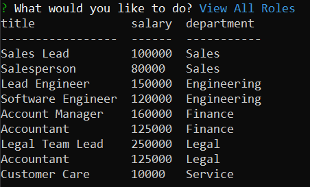

# employee-tracker

## Description 

This is an application using mysql2 and inquirer to update a database with employee information through a terminal.

## Table of Contents

* [Installation](#installation)
* [Usage](#usage)
* [Credits](#credits)
* [License](#license)

## Installation

Clone or fork repository on to local machine.

To install necessary dependencies, run the following command:
```
npm i
```
Need to create a .env file with mysql credentials

## Usage 

To use, first run the schema.sql and seeds.sql in the mysql terminal to generate and populate the database.

After, run node index.js in the terminal to start the employee management system.
  
Use the arrow keys to determine what action needs to be perfomed.

All Departments:  


All Roles:



All Employees:  


Refer to video demo on how to use this application.

### [Video Demo](https://www.youtube.com/watch?v=dC0G78olrZo)

## Credits

[Nodejs](https://nodejs.org/dist/latest-v16.x/docs/api/)

[mysql2](https://www.npmjs.com/package/mysql2)

[inquirer](https://www.npmjs.com/package/inquirer)

[console.table](https://www.npmjs.com/package/console.table/v/0.10.0)

[dotenv](https://www.npmjs.com/package/dotenv)

## License 
 
 This project is licensed under the MIT license.

[](https://opensource.org/licenses/MIT)

## Contributing Guidelines

Contact Me